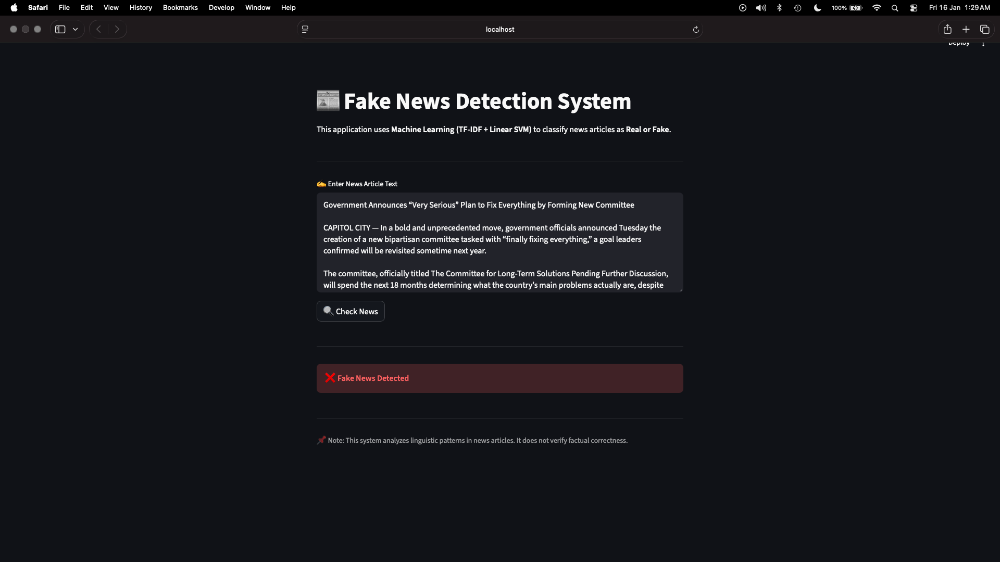
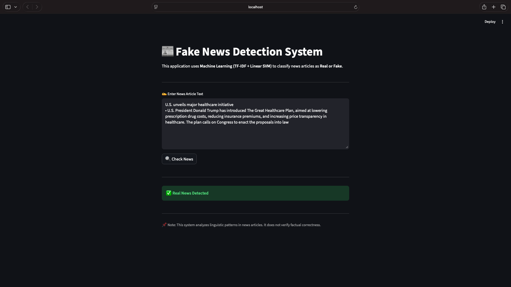

# 📰 Fake News Detection System

> A college mini project — a Machine Learning web app that classifies news articles as **Real** or **Fake** using TF-IDF vectorization and a Linear SVM classifier.

---

## 🖥️ Demo

| Fake News Detected | Real News Detected |
|---|---|
|  |  |

---

## ✨ Features

- 🔍 Instant classification of any news article text
- 🤖 Powered by a trained **Linear SVM** model
- 🧹 Automatic text preprocessing and cleaning
- ⚡ Fast and lightweight — no API calls needed
- 🌐 Clean web UI built with **Streamlit**

---

## 🧠 How It Works

```
User Input → Text Cleaning → TF-IDF Vectorization → Linear SVM → Real / Fake
```

1. **Text Cleaning** — removes special characters, lowercases the text
2. **TF-IDF Vectorization** — converts text into numerical feature vectors
3. **Linear SVM Prediction** — classifies based on learned patterns from training data

---

## 🛠️ Tech Stack

| Layer | Technology |
|---|---|
| Language | Python 3 |
| ML Model | Scikit-learn — Linear SVM |
| Vectorizer | TF-IDF (Term Frequency–Inverse Document Frequency) |
| Web Framework | Streamlit |
| Serialization | Pickle |

---

## 📁 Project Structure

```
fake-news-detector/
│
├── app.py              # Streamlit web application
├── text_model.pkl      # Trained Linear SVM model
├── vectorizer.pkl      # Fitted TF-IDF vectorizer
└── README.md
```

---

## 🚀 Getting Started

### Prerequisites

```bash
pip install streamlit scikit-learn
```

### Run the App
> Note: The trained model files (`text_model.pkl` and `vectorizer.pkl`) are excluded from the repository due to size limitations.

---

```bash
git clone https://github.com/your-username/fake-news-detector.git
cd fake-news-detector
streamlit run app.py
```

Then open your browser at `http://localhost:8501`

---

## 📌 Usage

1. Paste any news article text into the text box
2. Click **🔍 Check News**
3. The app will instantly return:
   - ✅ **Real News Detected** — article appears legitimate
   - ❌ **Fake News Detected** — article shows patterns of misinformation

> **Note:** This system analyzes **linguistic patterns** in text. It does not verify factual correctness against external sources.

---

## ⚠️ Limitations

- Model performance depends on the training dataset
- May not generalize well to highly domain-specific or very recent news styles
- Should be used as a supplementary tool, not as a sole fact-checking mechanism

---

## 📜 License

This project is open-source and available under the [MIT License](LICENSE).

---

## 👨‍💻 Author

**Md Faiyaz Ansari**
🔗 Mini project — built as part of college coursework